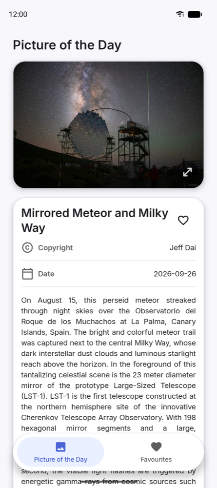
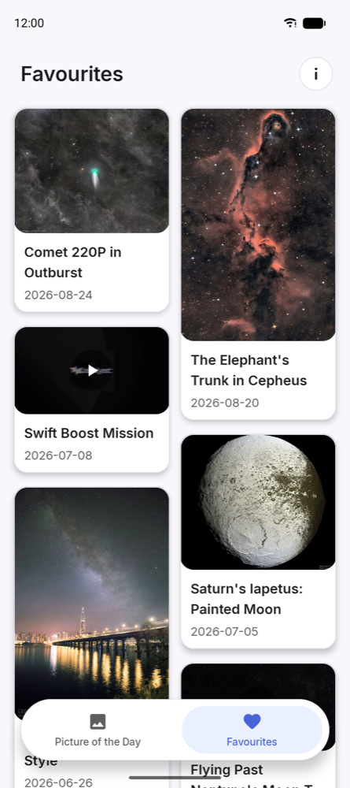
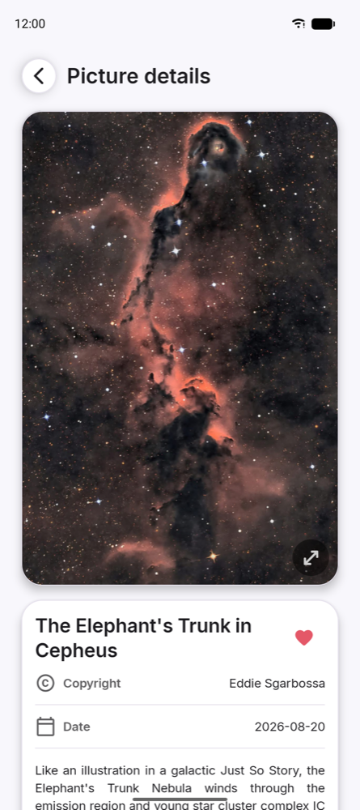
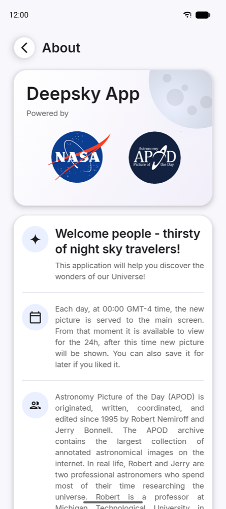
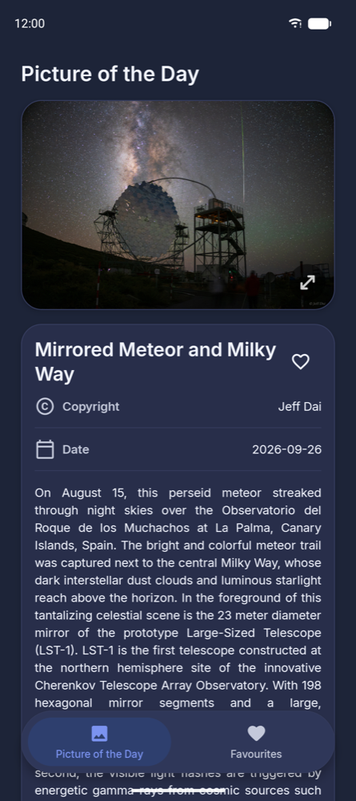
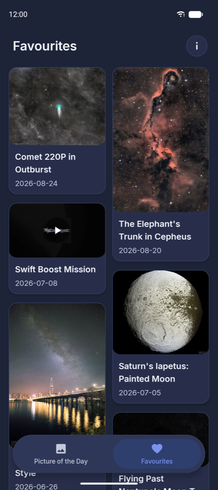
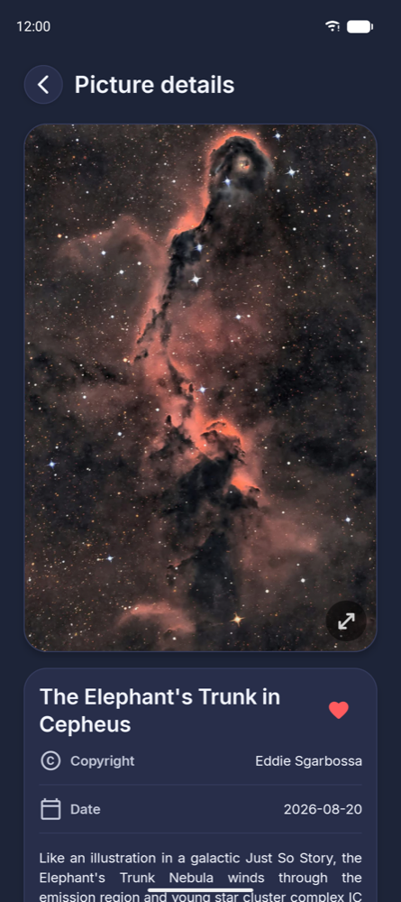
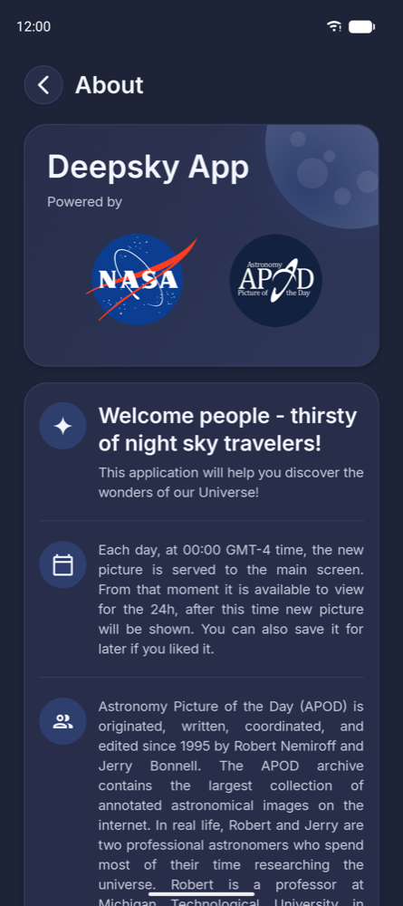

# 🚀 Deepsky App

A daily window into the universe: Deepsky App shows NASA's **Astronomy Picture of the Day** (APOD) —
a new image or video every day, with its title, explanation and copyright — and lets you keep the ones
you like in a local **Favourites** list.

<a href="https://play.google.com/store/apps/details?id=com.wojciechkula.deepskyapp">
  
</a>

The app is written in **Kotlin Multiplatform** with **Compose Multiplatform**, so the same code — UI
included — runs on Android and iOS. Only the **Android** app is published (on Google Play). The iOS
app builds and runs from this repository, but it is not released on the App Store and there are no
plans to release it.

## 📱 Screenshots

| | Picture of the Day | Favourites | Picture details | About |
|---|---|---|---|---|
| **Light** |  |  |  |  |
| **Dark** |  |  |  |  |

## ✨ Features

- **Picture of the Day** — today's APOD, refreshed automatically once NASA publishes the next one
  (a new picture appears every day at 00:00 GMT-4).
- **Images and videos** — pictures open full screen with pinch-to-zoom in HD; video APODs play inside
  the app.
- **Favourites** — save any picture to a local list and browse it as a grid (only the
  metadata is stored; images are loaded again from NASA).
- **Light and dark theme**, following the system setting.
- **About** — who is behind APOD and how the app works.

---

## 🕰️ Version 1.x.x (legacy)

The original app — **1.2.1**, the first published version — was an
Android-only app in the classic style: **XML layouts** with View Binding, Fragments with the
**Navigation Component**, **LiveData**, **Hilt**, **Retrofit** + Gson, **Glide** and **PhotoView**.

None of that code is on the current branches. It is preserved under the git tag
[`1.2.1`](../../tree/1.2.1):

```bash
git checkout 1.2.1
```

Users upgrading from 1.2.1 keep their saved favourites — the database is migrated in place.

---

## 🌌 Version 2.x.x (current)

Version 2.0.0 is a complete rewrite. **Everything below describes version 2.x.x** — the Kotlin Multiplatform rewrite that lives on the
current branches. For the 1.x.x app, see the section above.

### 🛠️ Tech stack

| Concern | Library |
|---|---|
| Language & platforms | Kotlin Multiplatform — Android + iOS |
| UI | Compose Multiplatform (Material 3), shared by both platforms |
| Navigation | Navigation 3 (`NavDisplay` + typed `NavKey` destinations) |
| Presentation | MVI — `StateActionsViewModel` over `StateFlow` + a one-shot action channel |
| Networking | Ktor Client (OkHttp on Android, Darwin on iOS) + kotlinx.serialization |
| Persistence | Room KMP with bundled SQLite and hand-written migrations |
| Dependency injection | Koin |
| Images | Coil 3 + `zoomable` for pinch-to-zoom |
| Video | Media3 ExoPlayer on Android, AVPlayer on iOS |
| Logging | Timber on Android, `NSLog` on iOS, behind a shared `Logger` interface |
| Concurrency | Kotlin Coroutines + Flow |
| Quality | ktlint, detekt, `kotlin.test` on both platforms |

### 🧱 Architecture

**Clean Architecture**, enforced by the module graph: features depend on `:domain` and never on each
other, `:data` implements the `:domain` interfaces, and `:core:*` modules are leaves.

```
:domain             # models, interactors, repository interfaces, sealed Result
:data               # Ktor APOD client, Room database, mappers, repository implementations
:core:common        # DateFormatter, Logger, NetworkMonitor
:core:designsystem  # theme, shared components, vector icons
:core:media         # video playback and video thumbnails
:core:mvvm          # StateActionsViewModel + ActionsEffect (MVI plumbing)
:core:navigation    # typed NavKey destinations
:feature:picture    # Picture of the Day + Picture details
:feature:favourites # the favourites grid
:feature:about      # the About screen
:shared             # navigation host, bottom bar, DI wiring, iOS entry point
:androidApp         # Android entry point
iosApp/             # iOS entry point (SwiftUI shell, Xcode project)
```

### ▶️ Build and run

**Requirements:** JDK 21, Android Studio (Android SDK 37); for iOS additionally a Mac with Xcode.
Minimum Android version is **8.0 (API 26)**.

1. Get a free APOD API key at <https://api.nasa.gov>.
2. Put it in `local.properties`, in `~/.gradle/gradle.properties`, or in the `APOD_API_KEY`
   environment variable:

   ```
   APOD_API_KEY=your_key_here
   ```

3. Build and run:

   ```bash
   ./gradlew :androidApp:installDebug   # Android: build and install on a connected device
   ./gradlew allTests                   # all tests, Android host + iOS simulator
   ./gradlew ktlint detekt              # static analysis
   ```

   For iOS, open `iosApp/iosApp.xcodeproj` in Xcode and run the `iosApp` scheme.

---

## 👨‍💻 Author

Implemented by [Wojciech Kula](https://www.linkedin.com/in/wojciechkula/) <br>
Powered by [NASA APOD](https://apod.nasa.gov/apod/)

> **Astronomy Picture of the Day** is originated, written, coordinated and edited since 1995 by Robert
> Nemiroff and Jerry Bonnell. The APOD archive contains the largest collection of annotated
> astronomical images on the internet.
